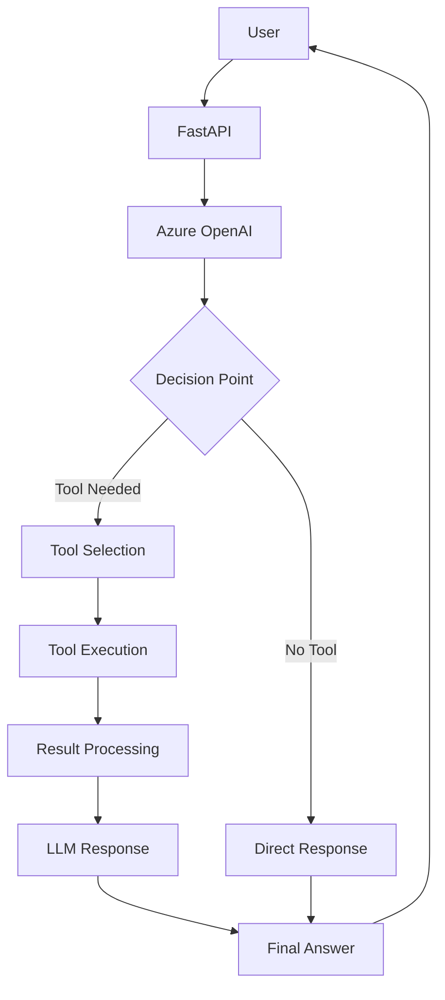
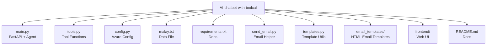
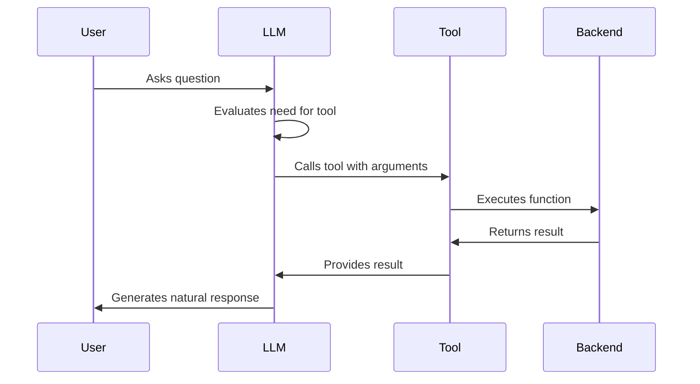

# 🧠 AI Chatbot with Tool Calling (FastAPI + Azure OpenAI + LangChain)

This project is a **production-ready AI chatbot backend** built with:

✅ **Azure OpenAI (GPT-4.1-Mini)**  
✅ **LangChain Agents & Tools**  
✅ **FastAPI backend**  
✅ **Custom tools including email lookup & web search**  
✅ **Extensible design to support MongoDB queries**

The chatbot is capable of:

* Understanding natural language queries
* Deciding whether a tool is needed
* Calling backend functions automatically
* Returning natural human-like responses

---

## 🚀 Features

### 🤖 LLM-Powered Chatbot

Uses **Azure OpenAI GPT-4.1-Mini** as the reasoning engine.

### 🛠 Tool Calling

The chatbot intelligently calls backend functions such as:

* 🔍 `web_search` — Searches DuckDuckGo
* 📧 `get_user_email_id` — Returns email IDs based on query
* (Future) 🗄 MongoDB query tools

### 🌐 REST API

One simple endpoint:

```
POST /chat
```

### 💬 Conversational Memory

Keeps context across messages.

### 📜 System Prompt Control

Defines chatbot policy & behavior.

---

## 🏗 Architecture Overview

```
User → FastAPI → Azure OpenAI → Tool Selected → Backend Executes
        ↑                                       ↓
        ←────────────── Final Answer ───────────
```

**LLM = Brain**  
**Tools = Muscles**  
**Backend = Orchestrator**



---

## 📂 Project Structure

```
AI-chatbot-with-toolcall/
├── main.py              # FastAPI app + Agent logic
├── tools.py             # Tool functions
├── config.py            # Azure credentials
├── malay.txt            # Profile data file
├── requirements.txt     # Python dependencies
├── send_email.py        # Email sending helper
├── templates.py         # Template selection / utilities
├── email_templates/     # HTML email templates
│   ├── admin_templete.html
│   └── user_templete.html
├── frontend/            # Simple web UI for the chatbot
│   ├── index.html
│   └── README.md
└── README.md            # Backend & project docs
```



---

## 🌐 Frontend UI

The web UI for this chatbot is developed in a separate repository and mirrored here for convenience:

* GitHub repo: https://github.com/MalayJain412/Frontend-UI-for-AI-Chatbot-fastapi
* Local folder in this project: `frontend/`
* Entry file: `frontend/index.html`
* Frontend docs: `frontend/README.md`

To try it out, start the FastAPI backend, then either open `frontend/index.html` directly in your browser or serve the `frontend/` directory with a static server (for example, VS Code Live Server or `python -m http.server`). Make sure any API base URL used in the frontend points to your running backend (for example, `http://127.0.0.1:8000/chat`).

---

## ⚙️ Installation & Setup

### 1️⃣ Clone repo & create venv

```bash
python -m venv venv
source venv/bin/activate   # Mac/Linux
venv\Scripts\activate      # Windows
```

---

### 2️⃣ Install dependencies

```bash
pip install -r requirements.txt
```

---

### 3️⃣ Configure Azure OpenAI

Create a `.env` file in the root directory of the project:

```env
AZURE_OPENAI_ENDPOINT=https://YOUR-RESOURCE.openai.azure.com/
AZURE_OPENAI_API_KEY=YOUR_KEY
AZURE_DEPLOYMENT=gpt-4.1-mini
AZURE_API_VERSION=2025-01-01-preview
```

> **Note:** The `config.py` file automatically loads these environment variables using `python-dotenv`. Deployment name must match your Azure Studio deployment.

---

### 4️⃣ Run server

```bash
uvicorn main:app --reload
```

Server runs at:

```
http://127.0.0.1:8000
```

---

## 🧰 Tools Explained

### 🔍 1. Web Search Tool

Searches online using DuckDuckGo API.

Used for **general knowledge queries**.

---

### 📧 2. Email Lookup Tool

Example:

```python
get_user_email_id("What is Malay's email?")
```

Returns:

```
malayjain1234@gmail.com
```

Logic:

| Name       | Email                                                     |
| ---------- | --------------------------------------------------------- |
| Malay Jain | [malayjain1234@gmail.com](mailto:malayjain1234@gmail.com) |
| Aniket     | [anni990@gmail.com](mailto:anni990@gmail.com)             |

Tool docstring tells the LLM **when** to use it.

---

## 🧠 How Tool Calling Works (Simple Explanation)

1️⃣ User asks a question  
2️⃣ LLM decides whether a tool is needed  
3️⃣ If yes → passes arguments to tool  
4️⃣ Backend executes Python function  
5️⃣ Result is returned to LLM  
6️⃣ LLM writes natural reply

Example:

```
User: What is Malay's email?
LLM → ToolCall(get_user_email_id)
Backend returns email
LLM responds naturally
```

Magic ✨



---

## 🧩 System Prompt Role

Controls:

✔ assistant behavior  
✔ tone  
✔ policy  
✔ general rules

Example rules:

* Prefer local tools for internal data
* Use web search only when required
* Do not mention tool names

---

## 🔊 Verbose Logging

`verbose=True`

Shows:

* tool selection
* reasoning chain
* inputs & outputs

Useful for debugging.

---

## 🛡 Security Notes

✔ API keys are never exposed  
✔ Tools run in backend only  
✔ Email lookup prevents hallucination  
✔ Invalid requests return safe output

---

## 🧪 Testing the Chat API

Send request:

```
POST /chat
Content-Type: application/json
```

Body:

```json
{
  "message": "What is Malay's email?"
}
```

---

## 🏛 Tech Stack

| Component | Technology       |
| --------- | ---------------- |
| Backend   | FastAPI          |
| LLM       | Azure OpenAI     |
| Agent     | LangChain        |
| Tools     | Python functions |
| Memory    | LangChain buffer |

---

## 📌 Why LangChain?

LangChain handles:

✔ conversation history  
✔ tool routing  
✔ argument passing  
✔ agent reasoning  
✔ debug logging

So you write less glue code.

---

## 🧠 Future Enhancements

📌 Add MongoDB query tools  
📌 Structured tool calling  
📌 Auth & rate limiting  
📌 Frontend UI  
📌 Docker image

---

## 🏁 Summary

This project demonstrates a **realistic production-grade AI chatbot backend** that combines:

🧠 Azure OpenAI reasoning  
🛠 Python business logic  
🚀 FastAPI deployment  
🧩 LangChain agents

It's clean, extensible, and powerful.

---

## 🤝 Contributing

PRs & suggestions welcome 👍

---

## 📄 License

MIT